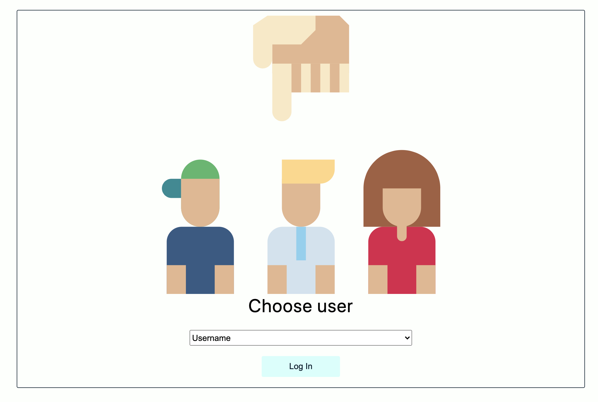
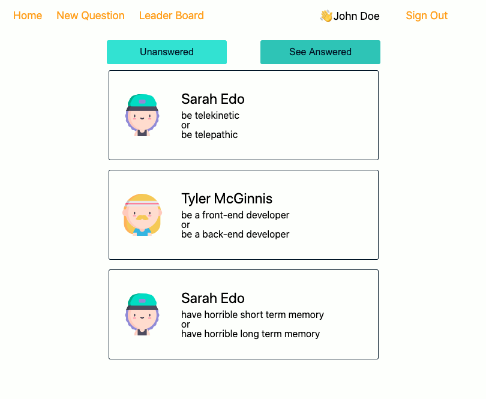

# Would You Rather Project

The `_DATA.js` file is provided, which represents a fake database and methods that let us access the data. 'avatarURL' was not provided and I used avatar images from [flaticon.com](https://www.flaticon.com/).

## About This App

This is a poll app that user can answer and create polls with two options.

### Login

This app begins on a login page. You need to select a user from the list.

### Home

The main page shows the question list that the logged-in user hasn't answered yet. If you click a question card, you can answer the question. If you click the answered tab on top of the question list, you can view the result of the poll which the logged-in user has already answered.

### New Question

You can post a new question from the New Question page.

### Leader Board

This is a user ranking based on the sum of questions that the user asked and answered.

### Sign Out

When you click the 'Sign Out' on the top right, it'll take you to the login page.

## Installation

1. Clone the GitHub repo: `git clone https://github.com/misakimichy/would-you-rather.git`

2. `$cd would-you-rather`

3. `$npm install`

4. `$npm start`
   The will start the app in port :3000 on your local machine.

## Create React App

This project was bootstrapped with [Create React App](https://github.com/facebookincubator/create-react-app). You can find more information on how to perform common tasks [here](https://github.com/facebookincubator/create-react-app/blob/master/packages/react-scripts/template/README.md).

## Contributing

This repository is the starter code for _all_ Udacity students. Therefore, we most likely will not accept pull requests. For details, check out [CONTRIBUTING.md](https://github.com/udacity/reactnd-project-would-you-rather-starter/blob/master/CONTRIBUTING.md).
