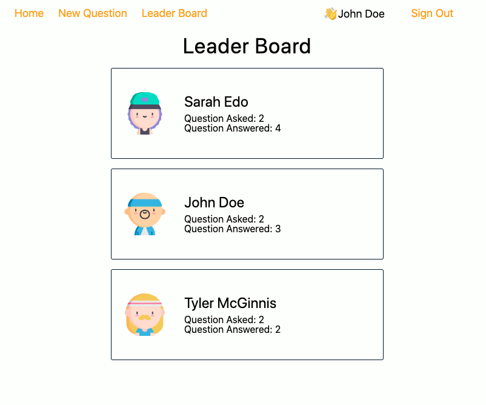
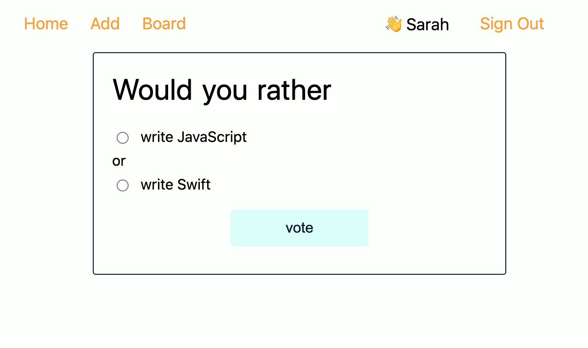
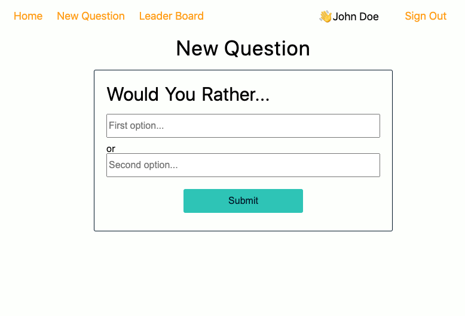
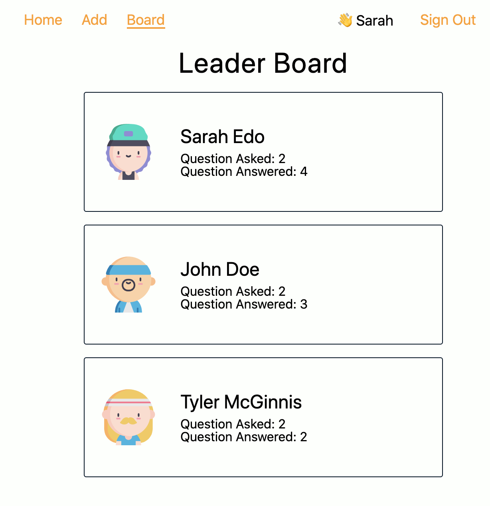

# Would You Rather Project

The `_DATA.js` file is provided, which represents a fake database and methods that let us access the data. 'avatarURL' was not provided and I used avatar images from [flaticon.com](https://www.flaticon.com/).

## About This App

This is a would you rather app that users can answer and create new polls, and see results.

### Login

This app begins on a login page. You need to select a user from the list.

### Home

The Home shows a list of questions that the user hasn't answered.

\
You can also lick the "See Answered" button to view the result of polls that the logged-in user has already answered.

### Poll page

You can select your answer to click a card.

Once you submit your choice, it automatically shows the total vote result.

### New Question

You can post a new question from the New Question page.

### Board

Leader board shows all users ranking based on the sum of questions that users asked and answered.

### Sign Out

When you click the 'Sign Out' on the top right, it'll take you to the login page.

## Installation

1. Clone the GitHub repo: `git clone https://github.com/misakimichy/would-you-rather.git`

2. `$cd would-you-rather`

3. `$npm install`

4. `$npm start`
   The will start the app in port :3000 on your local machine.

## Stack used

- React
- Redux
- React Router
- styled-component
